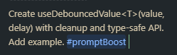

<!-- @format -->

<!--
TODO:
- Parallel programming
- Set budget to prevent overbilling
 -->

<!--
    _backgroundImage: linear-gradient(120deg, #89f7fe 0%, #66a6ff 100%);
-->

# <!--fit--> 🤖 GitHub Copilot in VS Code

**Dev Workshop, WPXPO**

Samin Yaser, SWE
Abdullah Al Asif, SWE

---

## 🛠️ Setup

-   VS Code Insiders
-   GitHub Copilot Extension

---

## ✨ Features: Code Completions

-   inline "ghost text" as you type
-   Tab to next edit

<!-- Removed duplicate scoped style block (h2/strong) now covered by global styles -->

---

## 💬 Features: Chat Modes

-   **Ask mode**: Regular chatting.
-   **Inline chat**: Quick chat in the editor/terminal for in-flow edits
-   **Edit mode**: Almost never used.
-   **Agent mode**: Most powerful; can create files, run tasks, and iterate with you

<!-- Removed duplicate scoped style block (h2/strong) now covered by global styles -->

---

## ⌨️ Essential Shortcuts

### 💬 Chat & Modes

-   **Inline Chat:** `Ctrl+I` / `⌘I`
-   **Chat View:** `Ctrl+Alt+I` / `⌃⌘I`
-   **Agent Mode:** `Ctrl+Shift+I` / `⌘⇧I`

💡 **Pro Tip:** Bind "Toggle Copilot" to your favorite key!

---

## 🎭 Context is King

### 📂 File Management

-   **Drag** files/folders/problems into Chat
-   **Type** `#fileName`, `#folder`, `#symbol`

### 🛠️ Power Tools

-   `#codebase` — semantic search
-   `@terminal`, `@workspace`

---

## ⚙️ Settings to Tweak
- `"chat.agent.maxRequests": 100` - Increase agent iterations
- `"github.copilot.chat.codesearch.enabled": true` - Enables codebase search
- `"github.copilot.chat.agent.thinkingTool": true` - Enables agent reasoning
- `"editor.aiStats.enabled": true` - View usage stats in status bar

---

## 🚀 Prompt Boosting

Use the [Prompt Boost](https://marketplace.visualstudio.com/items?itemName=chrisdias.promptboost) to easily improve your prompts.

-   Invoke the `#promptBoost` tool in your prompt

---

## 🌟 Awesome Copilot Repo

- Curated list of high‑quality prompts, agents, extensions, SDKs & learning resources
- Bookmark it: [github.com/github/awesome-copilot](https://github.com/github/awesome-copilot)

---

## 📝 Prompt Examples (1/2)

**React hook:**

> "Create useDebouncedValue<T>(value, delay) with cleanup and type-safe API. Add example."

**A11y:**

> "Refactor Modal for WCAG 2.2: focus trap, ARIA roles, ESC to close, Tab cycle. Add tests."

---

## 🧪 Prompt Examples (2/2)

**Inline Chat refactor (paste & run):**

> "Refactor selected code to be side-effect-free, improve naming, keep public API stable, and add JSDoc with examples. Don't change behavior."

---

## 🧠 Customizing Copilot's Brain (for WordPress)

Add a **`.github/copilot/prompt.md`** to guide Copilot in your WooCommerce plugin.  

**Example `prompt.md`:**
- **Tech Stack** → WordPress plugin + WooCommerce. Admin UI in React (`@wordpress/scripts`). Backend in PHP.  
- **PHP Standards** → WordPress Coding Standards. Snake_case. PHPDoc. `$wpdb->prepare()` for queries. Wrap all strings with `__()` and text domain `my-plugin-text-domain`.  
- **React & WP** → Use `@wordpress/components`, `@wordpress/api-fetch`, and `@wordpress/data`.  
- **WooCommerce API** → Use helpers like `wc_get_product()`, `WC()->cart`. Check WooCommerce is active before calls.  

---

## Prompt Examples (WooCommerce & React)

**WooCommerce Hook (PHP):**  
> "Write a PHP function hooking into `woocommerce_after_add_to_cart_button`. It should show a text input field and save its value as custom cart item data."  

**React Settings (Admin):**  
> "Build a React component with a `TextControl` and `Button`. On click, save value via `@wordpress/api-fetch` to `/my-plugin/v1/settings`."  

---

## Prompt Examples (Inline Refactor)

**WordPress Standards:**  
> "Refactor selected PHP code to follow WP Coding Standards. Snake_case, PHPDoc, and wrap strings in `__()` with text domain `my-plugin-text-domain`."  

---

## 🔍 Reviewing Awesome Copilot

- [**Prompts**](https://github.com/github/awesome-copilot/blob/main/README.prompts.md) → ready-to-use prompt examples for coding, testing, and docs.  
- [**Instructions**](https://github.com/github/awesome-copilot/blob/main/README.instructions.md) → tips to customize Copilot’s behavior with `.github/copilot/` files.  
- [**Chat Modes**](https://github.com/github/awesome-copilot/blob/main/README.chatmodes.md) → explains Ask, Inline, Edit, and Agent modes with best practices.  

💡 These resources are **community-curated** and updated regularly.

---

## Awesome Prompts (WooCommerce & PHP)

**REST API Endpoint:**  
> "Create a REST API endpoint `my-plugin/v1/products/featured` returning featured products (`wc_get_products`). Require `edit_posts` capability. Add PHPDoc and follow standards."  

**WP_Query Example:**  
> "Write `get_expiring_subscriptions()` using `WP_Query` to fetch `shop_subscription` posts where `_schedule_end` is within 7 days. Return post IDs."  

---

## 💰 Prevent Overbilling in Copilot Pro

### 🔎 Request Limits
- **300 premium requests/month included**  
- Beyond that → **$0.04 per extra request**

### 🛑 Avoid Extra Charges
1. Go to **GitHub → Settings → Billing & plans**  
2. Open **Budgets & alerts**  
3. Set a **Copilot budget**  
4. ✅ Enable **“Stop usage when budget limit is reached”**

### ⚖️ Behavior
- **Without limit** → Extra requests work, billed at $0.04  
- **With limit** → Requests stop, no charges beyond budget

=======
### 🙏 Thanks!

Get the slides from [GitHub](https://github.com/SaminYaser-work/copilot-presentation)
